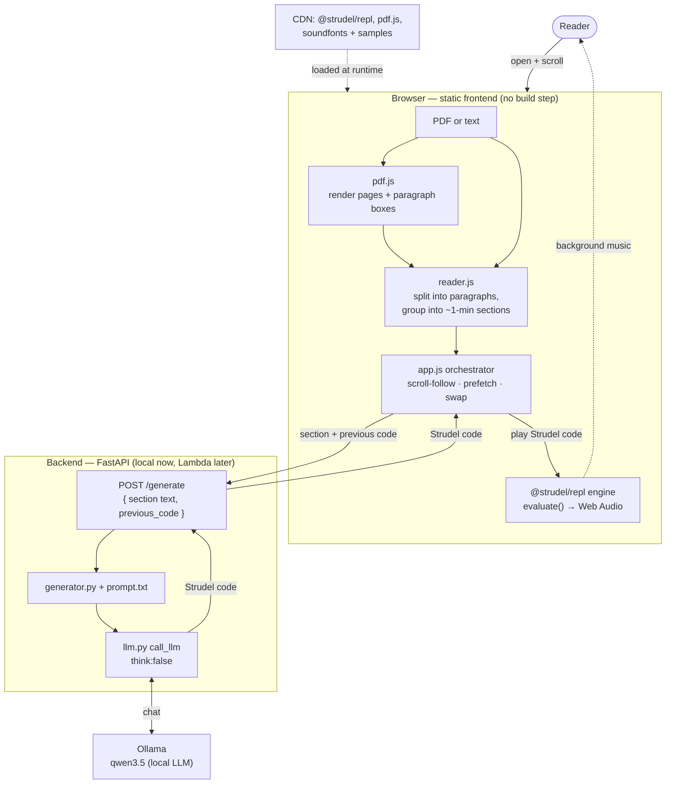

# BookMusic 🎴🎶

**Generate ambient background music for whatever you're reading — live, from a small local LLM, played in the browser with [Strudel](https://strudel.cc).**

Open a text file or a PDF, start reading, and BookMusic composes a gentle ~1‑minute
"score" for each section of the page, evolving the mood as the story does — lofi for a
rainy café, warm piano for a tender moment, dark phrygian for danger, swelling strings
for an epic dawn. As you scroll, the highlight follows you and the music advances on its
own.

> [!IMPORTANT]
> **This is an experiment / showcase, not a product.** The interesting idea here is the
> *approach*: instead of burning a lot of compute to synthesize audio with a large
> generative-audio model, we ask a **tiny** language model to write a few lines of
> [Strudel](https://strudel.cc) (a live‑coding music language) and let the browser
> synthesize the sound for free. The "music model" is ~1 line of code per layer. It's
> cheap, it runs on a laptop, and it's surprisingly evocative. Treat the output as
> *mood lighting*, not a soundtrack.

---

## Why this approach

Generating music as raw audio (diffusion/transformer audio models) is expensive and slow.
But background reading music doesn't need to be elaborate — it needs to be **calm,
evolving, and fit the mood**. That's a great fit for **algorithmic** music:

- A small LLM (≈0.8B–4B params, running locally via [Ollama](https://ollama.com)) is more
  than capable of writing a short, valid **Strudel** pattern when given a tight prompt.
- **Strudel** (a JS port of [TidalCycles](https://tidalcycles.org)) turns those few lines
  into real sound in the browser via the Web Audio API — soundfonts, drum samples, pads,
  the works — at zero inference cost.

So the "generation" is a few hundred tokens of text, and the "synthesis" is free. The
result is a hands‑free reading companion you can run entirely on your own machine.

Read the complete story on my [blog](https://damianogiorgi.it/articles/2026/06/a-tiny-llm-that-writes-music---the-story-of-bookmusic/)
---

## What it does

- 📄 **Reads text or PDFs.** Paste text, drop a `.txt`, or open a PDF (rendered page by
  page, in the browser, with [pdf.js](https://mozilla.github.io/pdf.js/) — nothing is
  uploaded).
- ✂️ **Groups paragraphs into ~1‑minute "sections."** Music changes per section, not per
  paragraph — books don't switch mood every sentence.
- 🎚️ **Composes per section.** Each section's text → a small LLM → a few lines of Strudel →
  played in the browser. The previous section's code is passed along so the mood *evolves*
  rather than jumps.
- 🪄 **Follows your reading.** A blue/purple gutter line marks where you are; scroll and the
  highlight + music advance automatically (toggle: *Follow scroll*). Click any paragraph to
  start/resume there. Long PDFs auto‑load more pages as you scroll.
- 🔁 **Prefetches & swaps.** The next section is generated while you read; on a section
  boundary the new pattern is swapped in (cycle‑aligned, with reverb tails covering the
  seam). Invalid output from the small model is auto‑retried.

---

## Architecture

A **static browser frontend** (the reader + the Strudel engine) and a **thin Python
backend** whose only job is to turn a chunk of prose into Strudel code via a local LLM.
The backend is deliberately tiny and swappable (local Ollama today; AWS API Gateway +
Lambda + Bedrock later).



### Layout

```
backend/                     # Python — turns prose into Strudel code
  server.py                  # FastAPI: POST /generate, serves the frontend in dev
  bookmusic/
    prompt.txt               # the system prompt (the heart of the project)
    generator.py             # builds the messages, calls the model
    llm.py                   # the only transport seam (Ollama now; Bedrock stub)
  samples/sample.txt         # demo document
  pyproject.toml             # uv-managed
frontend/                    # static JS, no build step
  index.html
  src/
    reader.js                # paragraph split + ~1-min section grouping + highlight
    pdfdoc.js                # pdf.js page rendering + paragraph bounding boxes
    player.js                # drives the @strudel/repl engine (setCode/evaluate/stop)
    app.js                   # orchestrator: scroll-follow, prefetch, section swap
    style.css
LICENSE                      # AGPL-3.0
```

### How a few key pieces work

- **Sectioning** (`reader.js`): split into paragraphs (blank lines; a wall of text is
  auto‑chunked on sentence boundaries), then group consecutive paragraphs to ~200 words
  (`WORDS_PER_SECTION`, ≈1 minute at ~200 wpm). Reading position is per‑paragraph; **music
  is per section**.
- **The engine** (`player.js`): we drive the **full `@strudel/repl`** web component (not the
  bare `@strudel/web`) so it loads the *same* sounds as strudel.cc — GM soundfonts, drum
  samples, piano. It also doubles as the live "Now playing" editor that highlights the
  active events.
- **PDF** (`pdfdoc.js`): pages are rendered to `<canvas>`, the text layer is grouped into
  paragraphs with bounding boxes, and a transparent overlay `<div>` per paragraph carries
  the gutter line — so the same highlight/section code works on a rendered page.
- **Scroll‑follow** (`app.js`): the current paragraph tracks whichever crosses a "reading
  line" ~38% down the viewport; the section's music is generated *debounced* (so fast
  scrolling doesn't thrash the generator) and swaps when you settle.

---

## The prompt (the actual "music model")

Almost all of the quality lives in [`backend/bookmusic/prompt.txt`](backend/bookmusic/prompt.txt).
It is a tightly‑constrained system prompt that teaches a small model to emit a **valid,
calm, background** subset of Strudel. Highlights of how it's tuned:

- **A restricted Strudel vocabulary** — only the sounds/effects that exist and sound good
  for reading (pads, soft synths, gm_ soundfonts, gentle drums, slow filter/pan
  modulation). The model is told never to invent functions.
- **Mood → STYLE → code.** A cheat‑sheet maps the passage's mood to one of several styles
  (AMBIENT, LOFI, CHILLHOP/JAZZY, WARM PIANO, DREAMY, TENSE, HAPPY/POP, EPIC/ORCHESTRAL,
  ANGER), and **each style has one labeled example** to copy. Without per‑style examples,
  small models collapse everything into "strings or a synth guitar."
- **Continuity.** The previous section's code is passed in as context, so the model evolves
  the same timbre instead of jumping at every boundary.
- **Develops over a minute.** Since each piece plays ~1 minute, the prompt pushes slow
  modulation (`.lpf(sine.range(...).slow(16))`, `.pan(...)`) rather than busy notes.

### Lessons learned (worth knowing if you tinker)

- **Disable "thinking."** Recent Ollama (0.30.x) defaults Qwen‑style *thinking* **on**, and
  the `ollama-python` `think=False` flag is **not honored** by the server — the
  chain‑of‑thought floods the reply and there's no usable code. The fix is to `POST`
  `/api/chat` directly with top‑level `"think": false` (see [`llm.py`](backend/bookmusic/llm.py)).
  This was the single biggest "it broke on another machine" gotcha.
- **Keep sampling minimal.** The custom Qwen Modelfiles bake in an aggressive
  `presence_penalty`; stacking our own `repeat_penalty` on top pushed the model into
  token‑salad. Just `temperature` + `num_predict`.
- **Small models need small, labeled examples.** 2–3 layer examples per style, an explicit
  anti‑repetition rule (small models love to loop a chord group until the token cap), and a
  **client‑side retry** when the generated Strudel doesn't parse.
- **Bigger model = steadier.** ~0.8B is fast and often good; 2B/4B follow the styles and
  stay valid more reliably. Pick via `BOOKMUSIC_OLLAMA_MODEL`.

---

## Run it locally

### Prerequisites
- [**Ollama**](https://ollama.com) running locally with a small **instruct** model pulled.
  The project was tuned with Qwen3‑class models (~0.8B–4B). Set `BOOKMUSIC_OLLAMA_MODEL` to
  whatever you have, e.g. `ollama pull qwen3:1.7b`.
- [**uv**](https://docs.astral.sh/uv/) for the Python backend.
- A modern browser (Web Audio + ES modules).

### Start
```bash
cd backend
uv sync
uv run uvicorn server:app --reload --port 8000
```
Open <http://localhost:8000>. The bundled sample text pre‑loads. **Click a paragraph** (or
press **Start**) to begin — the first click is what lets the browser start audio. Drop a
`.pdf`/`.txt` anywhere on the page to read your own.

> The backend serves the static `frontend/` in dev, so it's one command. In production the
> frontend is just static files and `/generate` becomes a small serverless endpoint.

### Configuration (env vars)
| Variable | Default | Purpose |
|---|---|---|
| `BOOKMUSIC_OLLAMA_MODEL` | `qwen3.5:0.8b` | Which Ollama model to use |
| `BOOKMUSIC_LLM` | `ollama` | Backend selector (`ollama` now; `bedrock` is a stub) |
| `OLLAMA_HOST` | `http://localhost:11434` | Where Ollama is listening |

A few tunables live as constants: `WORDS_PER_SECTION` and `PAGES_PER_RANGE`
([`app.js`](frontend/src/app.js)), and `TEMPERATURE` / `NUM_PREDICT`
([`llm.py`](backend/bookmusic/llm.py)).

---

## Missing features / roadmap

This is a sketch, so plenty is intentionally left undone:

- **PDF**: multi‑column layouts, scanned/image PDFs (needs OCR), running header/footer
  stripping, and true music continuity across page‑range jumps.
- **Transitions**: a real cross‑fade between sections (today it's a cycle‑aligned swap that
  leans on reverb tails). A dual‑scheduler/gain crossfade would be smoother.
- **No backend at all**: run the LLM fully in the browser (WebGPU / `transformers.js`) so
  the whole thing is static — a spike exists.
- **Cloud**: API Gateway + Lambda + Bedrock (the `bedrock` branch in `llm.py` is a stub).
- **More styles & smarter mood detection**, and per‑user tempo/volume controls.

---

## Contributing

Ideas and PRs are very welcome — this is meant to be played with. Especially:

- 🎼 **New genres/styles.** Add a labeled `### STYLE` block (description + one clean example)
  to [`prompt.txt`](backend/bookmusic/prompt.txt) and a line to the mood cheat‑sheet. Keep
  examples short (2–3 layers) so small models can copy them.
- 🧪 **Prompt evolution.** Better mood→style mapping, richer-but-valid Strudel, fewer
  retries on tiny models.
- 📚 **Better document handling.** PDF paragraph segmentation, EPUB, multi‑column.
- 💡 **New ideas.** Reading‑speed‑aware sections, per‑chapter themes, a "vibe" override, …

If you find a prompt tweak that makes a small model noticeably more reliable, that's
gold — open a PR with a before/after example.

---

## License

**[GNU AGPL‑3.0](LICENSE).** BookMusic is a web app built on **Strudel, which is itself
AGPL‑3.0** — so AGPL is the natural, consistent choice: anyone who modifies BookMusic *and
runs it as a network service* must make their source available. If you fork and host it,
share your changes. 🙂

### Acknowledgments / third‑party
- [**Strudel**](https://strudel.cc) — AGPL‑3.0 — the live‑coding engine that makes the sound.
- [**pdf.js**](https://mozilla.github.io/pdf.js/) — Apache‑2.0 — in‑browser PDF rendering.
- [**Ollama**](https://ollama.com) (MIT) + your chosen LLM (e.g. **Qwen**) — local generation.
- [**FastAPI**](https://fastapi.tiangolo.com) / **uvicorn** / **httpx** — the backend.
- Soundfonts & drum samples are loaded at runtime by Strudel from its community sample banks
  (various open licenses).
